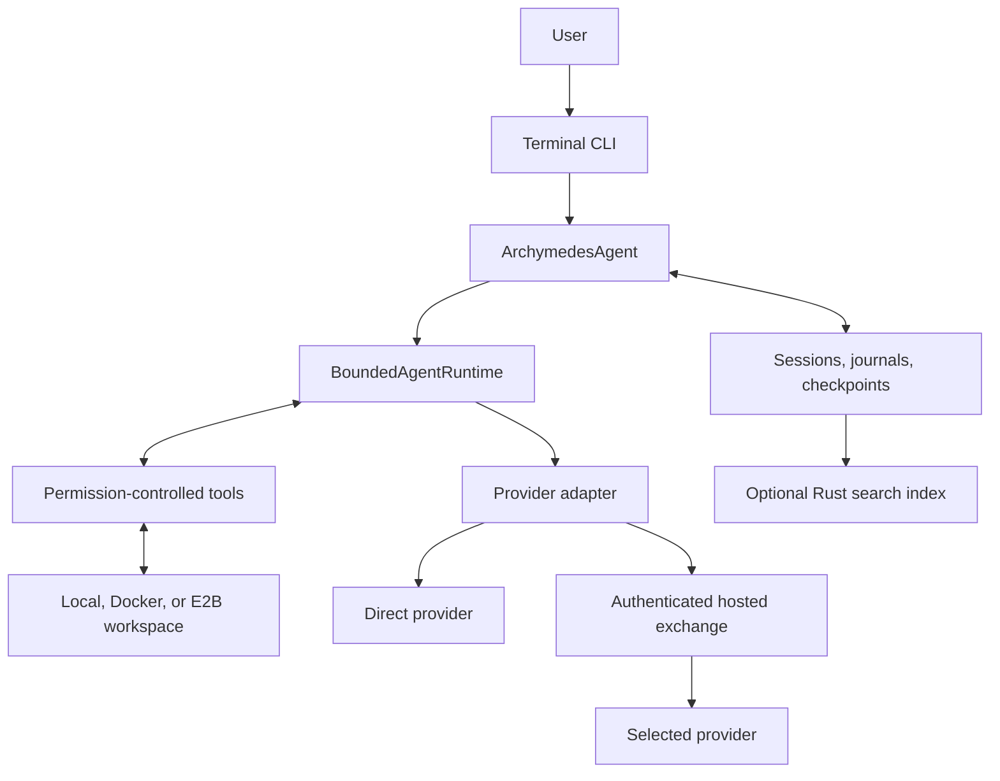

# Architecture for a new contributor

## The system

Archymedes is a local coding agent with optional hosted model access. Model execution and workspace execution are independent choices: a hosted model can operate through tools on a local project, and a direct provider can be used with an isolated sandbox.

## Public modules

| Module | Responsibility | Start reading |
| --- | --- | --- |
| CLI | Input, terminal presentation, slash commands, approvals | `packages/archymedes-cli/src/archymedes.ts` (`main()`), with entry-point support in `src/app/`; sections and import rules in [MODULE_MAP.md](MODULE_MAP.md) |
| Application agent | Workspace setup, permissions, session persistence, checkpoints | `packages/core/src/cli/agent.ts` |
| Bounded runtime | Model/tool loop, cancellation, budgets, retry limits, verification | `packages/core/src/agent-runtime.ts` |
| Provider adapters | Translate common agent requests into provider APIs | `packages/core/src/providers/` |
| Hosted client | Authentication, caps, request identity, receipt decoding | `packages/core/src/providers/archymedes-cloud-agent.ts` |
| Receipt presentation | Explain choices, attempts, forecasts and charges | `packages/archymedes-cli/src/render/routing-receipt.ts` |
| State sidecar | Rebuildable SQLite/FTS history index | `packages/archymedes-state/README.md` |

## One user turn

1. CLI accepts the objective and selects the configured workspace/provider.
2. The application agent assembles history, instructions, tools, and a checkpoint.
3. The bounded runtime allocates one logical model request.
4. The provider returns text, tool requests, usage, and optionally a hosted receipt.
5. The runtime checks permission before executing tool actions.
6. Tool results return to the model; another iteration gets a new request identity.
7. Verification evidence informs completion status. A changed file alone is not proof of success.
8. Session records, usage, and the final result are presented to the user.

Transport retries occur inside step 4. They retain the same request identity. A fresh model iteration is different work and must not reuse that identity.

## State and authority

- Session snapshots and event journals are authoritative; the optional search index is disposable and rebuildable.
- Checkpoints implement undo for workspace changes.
- A model proposes actions; the runtime enforces permission and execution limits.
- Provider-reported usage is the accounting input. Estimated cost, settled cost, predicted quality, and evaluated quality are separate concepts.
- Hosted clients consume public contracts. Routing decisions and balances are owned by private services.

## Hosted boundary

The public client sends a model request, a maximum charge, and a task profile. The hosted service reserves credit, selects an eligible provider, executes work, settles measured usage, and returns a receipt.

Do not assume all hosted implementations are the same. There is a TypeScript reference/package implementation and a separate deployable hosted runtime. An improvement in one is not automatically active in the other. Cross-implementation contract tests are more valuable than duplicated assumptions.

## Design invariants

- Never turn a transport retry into a new paid operation by accident.
- Never count caller cancellation or an absent credential as evidence of provider unreliability.
- Filter hard constraints before comparing eligible candidates.
- Do not aggregate different currencies into one total.
- Preserve forecasts as forecasts; verification requires evidence.
- Keep local use functional without optional cloud services or the native index.
- Public documentation must not become a copy of private implementation details.
